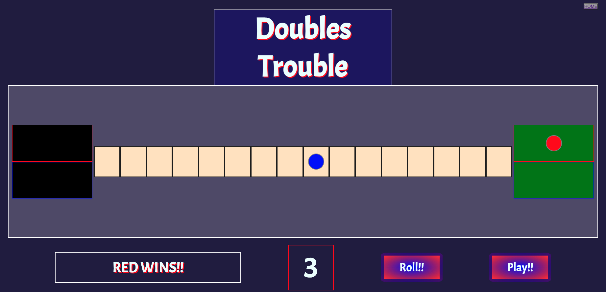

# Doubles Trouble

### A Browser Game by David Caldwell

### 10/7/2022

---

Links:

### [SURGE Deployed Game](https://doubles_trouble_browser_game.surge.sh/) | [GitHub](https://github.com/LeaderOfTheLost/doubles_trouble_browser_game) | [Trello-Board](https://trello.com/invite/b/wli4dhMr/34b0c38d5945e4420695c05a510398c6/u1-game-project)

---

# Game Description

## Be first to move your dot to the other side of the board. While you are trying to move across the board you can send your opponents dot back to the start by landing on them and taking their place, putting them in Trouble.

---

## How to get started

- On the landing page, click "Let's Play"
- Each player has a dot that they will try to get to the opposite side of the board
- Red goes first

## Game Rules

- Click the dot to move, it will move the amount of spaces you shown
- Blue players then moves their dot
- If a player lands on a space with the opponents dot, the opponents dot is moved back to the start and the player takes over that position
- First to move their dot to the end of the board wins!!

---

## Gameplay Screenshots

Start

---

---

Mid-game

---

---

Winner

---

---

### **_Future Updates_**

- [ ] Working Roll Button
- [ ] Multiple Dots
- [ ] Larger board with more players
- [ ] Scoreboard to track wins
- [ ] Animated Dice
- [ ] Slower Gameplay

---

#### Credits:

Game idea - [Trouble](https://hasbrogaming.hasbro.com/en-us/product/trouble-game:861A1979-5056-9047-F547-FF2711C8C223)

Landing background - [Image](https://www.pexels.com/photo/photo-of-multicolored-illustration-2832382/)

Docs:

- [MDN Docs](https://developer.mozilla.org/en-US/)
- [W3Schools](https://www.w3schools.com/)

---
